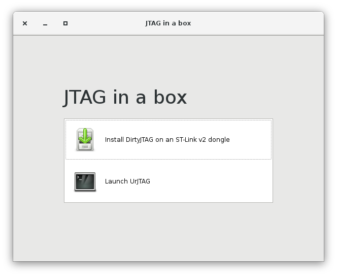
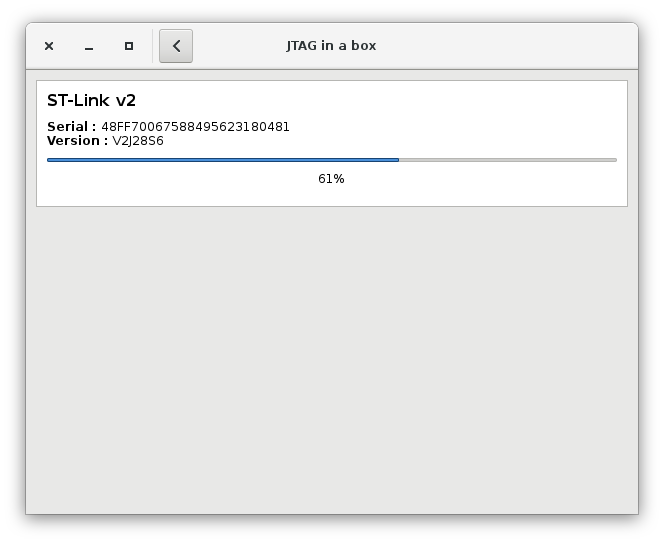
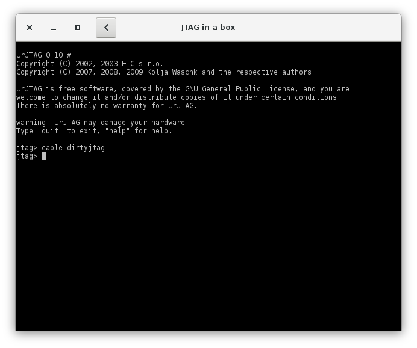

# JTAG in a box

Finally an inexpensive and easy to use JTAG solution (hardware+software). Intended for backyard hardware enthusiasts, also known as OpenWRT/LEDE router hackers :-)

Pick yourself a $2 ST-Link dongle (available in many chinese shops), and you will be ready to hack in minutes!

JTAG in a box is distributed as an AppImage. It should run pretty much everywhere and be self-sufficient (on major Linux distributions such as Ubuntu, Fedora or Arch).

## I want some !

 * [Runs-on-everything AppImages built by our talented artisans (recommended)](https://github.com/jeanthom/jtaginabox/releases)
 * [Compile it yourself](docs/building.md)

## Screenshots

